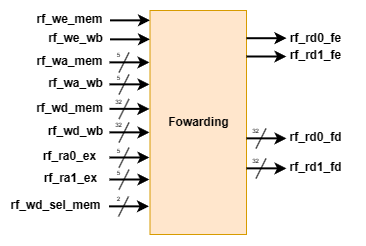
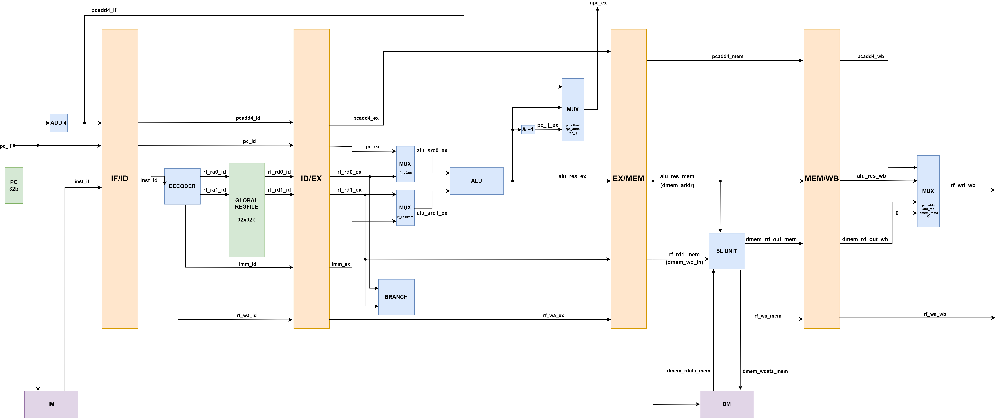

# <center> 五级流水线CPU设计 </center>
## <center> 俞嘉权 PB22010390 </center>
#### <center> 2024年春季学期，计算机组成原理实验 </center>

### 设计概述

流水线技术的基本思想是将一个复杂的任务分解成几个简单的步骤，每个步骤作为一个阶段。这种分解使得每个阶段的模块可以并行工作，从而提高整体的处理速度。在流水线设计中，CPU不必等待一个完整的指令执行完毕再开始下一个，而是在前一个指令完成某个阶段后，下一个指令就可以开始这个阶段的处理；在阶段之间引入段间寄存器以分隔对应于处在不同阶段的指令的数据。这样，CPU的时钟周期就可以取作各阶段的关键路径的组合逻辑延时的最大值而不是整条数据通路的关键路径的组合逻辑延时，这大大提高了CPU的吞吐率和主频。

五级流水线是早期计算机的一种经典架构。1970年代，IBM公司的360/91计算机使用MIPS架构首次将流水线技术应用到了实用的计算机设计中（MIPS是一种高度流水线化的RISC架构），极大提高了计算机的性能，所使用的正是五级流水线结构。现代的大多数CPU都采用了流水线技术，但流水线的级数和设计细节要复杂许多。

五级流水线的阶段划分为：
- 取指（IF）: 这一阶段负责从内存中获取下一条指令。这个过程包括计算指令地址和从指令内存读取指令数据。
- 译码（ID）: 在这一阶段，CPU解析指令的具体操作和涉及的寄存器，读取寄存器文件以获得操作数。
- 执行（EX）: 根据指令类型（如算术运算、逻辑运算等），进行实际的计算或操作。
- 访存（MEM）: 如果指令涉及数据的读取或写入，这一阶段会处理与数据内存的交互。
- 写回（WB）: 将执行结果写回到寄存器文件中，完成指令的执行过程。

这样划分的优势有：
- 各阶段功能的合理分配：每个阶段的硬件模块的组合逻辑的延时大致相等，从而在流水线级数一定的情况下充分提升了CPU的时钟频率，提高了CPU的性能。
- 减少冲突和延时：将指令执行过程分解为五个独立的阶段有助于减少不同指令之间的资源冲突（如寄存器和内存的使用），并允许更细粒度的优化和调度；所遇到的冒险（数据冒险、控制冒险等）也容易处理，是简单的流水线CPU的设计。
- 支持更高级的优化技术：五级流水线的基础结构为许多高级处理技术提供了可能，包括超标量执行、动态指令调度、分支预测和乱序执行等。这些技术都依赖于流水线的基本分解，以进一步提升性能。

本次实验设计的CPU中每个阶段的硬件模块与我们之前的单周期CPU基本一致，在原来的基础上，通过段间寄存器在模块之间进行连接，从而对数据的传递引入时序，实现流水线的分级。我们还需要考虑流水线CPU中可能出现的冒险情况，如数据冒险、控制冒险等，并设计相应的解决方案。

### 设计细节

#### 冒险处理

流水线CPU在运行时可能会发生依赖关系，即后续指令需要使用前一条或前几条指令的执行结果，而此时前一条或前几条指令尚未得出执行结果或者得出的执行结果尚未写回，这一现象称为冒险。冒险的处理是流水线CPU设计中的一个重要问题，我们需要在设计中考虑所有可能的冒险情况，并采取相应的措施来解决这些冒险。

我们首先考虑五级流水线CPU的所有可能的冒险情况：
- 数据冒险：在流水线中，后续指令可能需要使用前一条或前几条指令的执行结果。而此时前一条或前几条指令的执行结果尚未写回。我们采用的方法是检测到这种情况，然后进行数据前递。我们考虑所有的可能的数据冒险情况，包括：
  - 前面的指令需要将内容写入数据内存而后面的指令需要从数据内存种读取内容。在我们的设计中，这种情况并不存在，因为数据内存的读写都是在 MEM 阶段进行的，后面的指令进行到 MEM 阶段需要读数据时前面的指令已经完成了数据写入。
  - 前面的指令需要将内容写入寄存器文件而后面的指令需要从寄存器文件种读取内容。从寄存器文件读取数据的操作在 ID 阶段进行，而写入操作在 WB 阶段进行，ID 阶段与 WB 阶段相差 3 个时钟周期；因此，若发生依赖关系的两条指令相隔 3 个时钟周期以上，我们无需考虑冒险，我们只需考虑以下情况：
    1. 发生寄存器数据冒险的两条指令相隔 3 个时钟周期：此时当后指令进入到 ID 阶段时，前指令执行到 WB 阶段。我们只需要在 ID 阶段检测到这种情况，然后进行数据前递。也即，在读寄存器时，若下个周期即将向这个寄存器写入值时，应直接利用组合逻辑读出将写入的值；这也被称为寄存器文件的写优先机制。
    2. 发生寄存器数据冒险的两条指令相隔 2 个时钟周期：此时当后指令进入到 EX 阶段时，前指令执行到 WB 阶段。我们只需要在 EX 阶段检测到这种情况，然后进行数据前递。也即，在 ALU 计算时，若源操作数有寄存器并且下个周期即将向这一地址寄存器写入值时，应直接利用组合逻辑将源操作数更改为即将写入的值。
    3. 发生寄存器数据冒险的两条指令相隔 1 个时钟周期，并且即将写入寄存器的值来自于 ALU 的计算结果：此时当后指令进入到 EX 阶段时，前指令执行到 MEM 阶段。我们只需要在 EX 阶段检测到这种情况，然后进行数据前递。也即，在 ALU 计算时，若源操作数有寄存器并且下个周期即将向这一地址寄存器写入值来自于 ALU 的计算结果时，应直接利用组合逻辑将源操作数更改为 ALU 的计算结果。
    4. 发生寄存器数据冒险的两条指令相隔 1 个时钟周期，并且即将写入寄存器的值来自于 MEM 的读取结果（这一冒险也称为 L-U 数据冒险）：此时当后指令进入到 EX 阶段时，前指令执行到 MEM 阶段。但是 MEM 阶段的组合逻辑延时主要来自于访存操作；也就是说，在后指令的 EX 阶段，源操作数将要传递给 ALU 时，MEM 阶段的前指令的读取操作尚未完成，如果直接数据前递就会导致错误。但如果我们在 EX 阶段增加延时模块来等待 MEM 阶段的读取操作完成的话，又导致CPU的时钟周期的延长，让其他指令也为这些访存指令浪费等待时间，降低CPU的主频和性能。为了处理这一情况，我们这样设计：在 ID 阶段检测到这一情况时（此时后指令在 ID 阶段，前指令在 EX 阶段），将处在 ID 阶段的后指令 hold 一个周期（也就是清空 ID 阶段到 EX 阶段的段间寄存器，并且停滞 ID 阶段之前的），即在下一时钟周期开始时，后指令不再继续传递到 EX 阶段，而是等一个周期之后再向后传递，这相当于在流水线中加入了一个气泡。这样，当后指令进入 EX 阶段时，由于他被停滞了一个周期，此时前指令已经执行到 WB 阶段，这是情况 b 的情况，我们可以直接进行数据前递。
    5. 发生寄存器数据冒险的两条指令相隔 1 个时钟周期，并且即将写入寄存器的值来自于 PC ：我们在处理控制冒险时所设计的模块会解决这一问题。
- 控制冒险：在流水线中，后续指令可能会受到前一条或前几条指令的控制流的影响，冒险的情况是：前指令是分支指令，它的执行结果是将要进行跳转，但是这一进行跳转的判断信号以及跳转前往的地址将在前指令的 EX 阶段得出，此时后面又连续地有两条指令进行到 ID 和 IF 阶段了，这两条后指令都是被错误读取的指令，只需要消除他们即可（也就是清空 IF 阶段到 ID 阶段的段间寄存器和 ID 阶段到 EX 阶段的段间寄存器），这样被错误读取的指令就不会被运行，这相当于在流水线中加入了两个气泡。由于被错误读取的指令没有执行，所以避免数据冒险的情况 e 中的情况。

#### 段间寄存器 IR

段间寄存器（InterSegment Registers）是流水线CPU中的重要组成部分，它用于分隔不同阶段的数据，保证数据的传递是有序的。在我们的设计中，我们使用了 4 个段间寄存器，分别用于 IF 到 ID、ID 到 EX、EX 到 MEM、MEM 到 WB、WB 到 IF 的数据传递。这些段间寄存器在每个时钟周期的上升沿将数据传递到下一个阶段，保证流水线的正常工作。它还有 4 个额外的接口，rst 、en 、stall 和 flush：
- rst 的效果为异步清空，当此信号高电平时段间寄存器的所有寄存器都将被清空，与 CPU 的 rst 信号连接，它的优先级最高。
- flush 的效果为同步清空，若时钟上升沿此信号高电平，段间寄存器的所有寄存器都将被清空，它的优先级高于 stall （控制冒险时产生 flush 信号（尤其是 IF 到 ID 的 flush 信号），这是为了给控制冒险以更高的优先级）。
- stall 的效果为停驻，若时钟上升沿此信号高电平，输出仍保持之前的值不变，而非接收输入（也即其是反向的写使能信号，它的优先级高于 en ）。
- en 的作用是让段间寄存器受到 PDU 的控制，保证其与 PC 寄存器 en 端口的同步。段间寄存器的 en 端口连接到 global_en 。

段间寄存器的代码见 `Intersegment_register.v` ，这个模块是一个通用的段间寄存器，即它可以代码复用于 IF2ID, ID2EX, EX2MEM, MEM2WB 这4个段间，这样做的弊端是每个段间都是有一些端口是空接的，会导致电路资源的浪费，所以使用时也可以分别在每个段间把空接的那些端口删去，从而分别设计为每个段间的专用模块。

#### 数据前递单元 DFU

数据前递单元（Data Forwarding Unit）用于解决数据冒险中可以前递的情况，它处理数据冒险中的情况 b 与情况 c ，模块示意图如下：


<center>  <b>Schematic of DFU</b>  </center>

它的各个端口是：
- rf_we 指寄存器文件写使能信号，WB 与 MEM 段都需传入前递单元。
- rf_wa 指寄存器文件写地址，WB 与 MEM 段都需传入前递单元，用于比对。
- rf_wd 为 WB 段的寄存器文件写数据，作为 WB 段前递数据。
- rf_wd_sel 为 MEM 段的寄存器文件写数据的选择信号，用于判断 MEM 段指令是否将 ALU 的结果作为写入数据，若是，则可以将 ALU 的结果作为前递数据。
- alu_res_mem 为 MEM 段的 ALU 计算结果，作为 MEM 段前递数据。
- rf_ra 为传入 EX 段的寄存器文件读地址，用于与 MEM 段、WB 段信号比对确定前递是否发生。
- rf_rd 为传入 EX 段的寄存器文件读出数据。 
- rf_rd_out 是 DFU 的输出，若不发生前递，则输出 rf_rd ，若发生前递，则输出前递数据。

数据前递单元的代码见 `DFU.v` 。另外，实现寄存器的写优先以处理数据冒险中的情况 a ，写优先过程在寄存器文件 module 代码如下：

```verilog
  assign rf_rd0       = (rf_we && (rf_ra0 == rf_wa) && rf_wa) ? rf_wd : reg_file[rf_ra0];
  assign rf_rd1       = (rf_we && (rf_ra1 == rf_wa) && rf_wa) ? rf_wd : reg_file[rf_ra1];
```

#### 段间寄存器控制模块 SegCtrl

段间寄存器控制模块用于控制段间寄存器的 stall 和 flush 信号，产生 L-U 数据冒险和控制冒险所需要的气泡，模块示意图如下：


<center>  <b>Schematic of SegCtrl</b>  </center>

它的各个端口是：
- rf_we 为 EX 段寄存器文件写使能信号，需要传入以判断 Load-Use 冒险是否发生。
- rf_wd_sel 为 EX 段寄存器文件写数据的选择，需要传入以判断 Load-Use 冒险是否发生。
- rf_wa 为 EX 段寄存器文件写地址，需要传入以判断 Load-Use 冒险是否发生。
- rf_ra0_id 与 rf_ra1_id 用于比对确定 Load-Use 冒险是否发生。
- npc_sel 为下个 PC 选择器的控制信号，用于确定控制冒险是否发生。
- 输出信号为各段间寄存器对应的 stall 与 flush 信号。

段间寄存器控制模块的代码见 `SegCtrl.v` 。

#### CPU顶层设计


<center>  <b>Datapath of PipelineCPU</b>  </center>

CPU顶层的数据通路如图，在原先单周期CPU已经例化各模块的基础上，只需将信号定义为多阶段的，将需要传递的信号在段间寄存器间传递并且例化新增的模块即可。