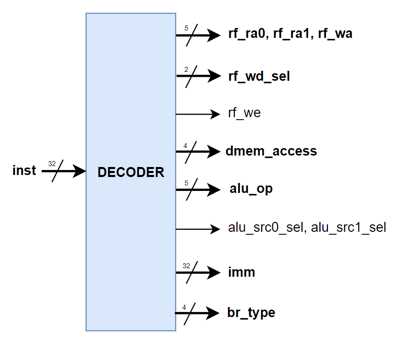

# 
 单周期CPU设计 

## 
 俞嘉权 PB22010390 

#### 
 2024年春季学期，计算机组成原理实验 

### 设计概述

基于 RISC-V 指令集架构，设计一个完整的单周期CPU，这一CPU支持基础的算术与逻辑运算指令与跳转和访存功能。

实现这一简单的单周期CPU所需要的模块为：
1. 程序计数器（PC）
2. 指令内存（INST_MEM）
3. 译码器（Decoder）
4. 寄存器文件（Regfile）
5. 算术逻辑单元（ALU）
6. 分支控制模块（Branch）
7. 访存控制单元（SLU）
8. 数据内存（DATA_MEM）
9. 选择单元（MUX）

  <b>Datapath of CPU</b>  

CPU的数据通路如图，使用verilog语言完成这些设计。

### 设计细节

#### 程序计数器 PC

在CPU中，程序计数器（Program Counter）寄存器时刻存储了正在执行的指令的地址。它的功能是将当前指令的地址传递给指令存储器，从而读出此时正确的指令内容。同时，它也需要能够接受下一条指令地址的输入，并在时钟上升沿到来时更新自己的值，从而实现指令的连续运行。

寄存器的写入操作应当在每个时钟周期内进行；因而，CPU的 PC 寄存器理论上是不需要使能信号的。这里保留使能信号是用于便于我们的调试，是为了在FPGA上运行我们的设计时，可以引入来自 PDU 的控制逻辑；使我们在调试的时候可以在合适的时机使CPU停下来以观察CPU的执行情况。在复位 PC 寄存器时，我们将其复位为 $0x00400000$ ，这是 $RV32I$ 指令集程序段的起始地址。$RV32I$ 是32位架构，按字节寻址，一条指令（一个字）为4字节，因此 ADD4 模块中 PC 的自增量为4；在向指令内存 INST_MEM 取指时，略去 PC 的末2位作为地址（32位机器的内存中的一个位置存储32位数据，即一个字，4字节）。ADD4 模块中还有一个停机判断，若停机信号为真，则PC不再自增，保持当前值；在 $RV32I$ 架构中，停机指令为 $0x00100073$ ，即 $ebreak$ 指令。

  <b>Schematic of NPC-MUX</b>  

如图，选择单元 NPC-MUX 选择下一个周期给到PC寄存器的值，它可以是自增后的 pc_add4 （无分支和跳转），也可以是来自 ALU_res 的 pc_offset （有分支和跳转）； jalr 指令要求将最低位置为 $0$ ，因此端口 pc_j 是 ALU_res 与 ~1 按位与的结果。选择信号 NPC_sel 来自分支控制模块 Branch 。

代码及注释见 `PC.v` ，`ADD4.v` 与 `MUX2.v` 。

#### 译码器 Decoder

  <b>Schematic of Decoder</b>  

译码器是CPU的心脏，它负责根据输入的指令生成相应的控制与数据信号。各个输出端口的作用是：
- alu_op：ALU 的运算模式码；
- imm：经过扩展的立即数；
- rf_ra0、rf_ra1：寄存器堆的读地址；
- rf_wa：寄存器堆的写地址；
- rf_we：寄存器堆的写使能；
- alu_src0_sel、alu_src1_sel：ALU 的源操作数选择信号；
- dmem_access：访存类型；
- rf_wd_sel：寄存器堆写回数据选择器的选择信号；
- br_type：分支跳转的类型；
- ifhalt：是否停机。

译码器模块是一个巨大的组合逻辑单元，所有的信号都根据 inst 的数值结合对应指令集的译码规则得出。若一条指令中没有某个输出信号，则该信号在当前周期不起作用，只需要保证起作用的信号是正确的即可。为方便仿真调试的时候看得清晰，我们的设计中将当前指令中没有的信号都赋为 $0$ 。

代码及注释见 `Decoder.v` 。
#### 寄存器文件 Regfile

  <b>Schematic of Regfile</b>  

如图，寄存器文件是一个 $32 \times 32$ 的寄存器堆，rf_ra0 - rf_rd0、rf_ra1 - rf_rd1 为数据读取端口；rf_wd - rf_wa 为数据写入端口； rf_we 为写使能信号。读端口、写端口和写使能信号都是由译码器 Decoder 提供的。寄存器文件的写入操作应当在每个时钟上升沿进行，读操作是时钟异步的（组合逻辑），即只要地址给定，对应寄存器的数值就能读出，而无需等待时钟边沿的到来。我们的CPU并没有对寄存器进行复位的功能需求。用户在编写汇编程序时，除了 $0$ 号寄存器始终为 $0$ 之外，不应当假定任何寄存器具有固定的初始值；因此，我们在实现CPU时，也取消了寄存器堆的复位端口信号。debug 接口 debug_reg_ra、debug_reg_rd 这一对端口与数据读端口功能一致，只用于仿真与上板时的调试。CPU在正常运行时并不会用到这两个端口。

代码及注释见 `RegFile.v` 。

#### 算术逻辑单元 ALU

  <b>Schematic of ALU</b>  

ALU （Arithmetic Logical Unit）是一个组合逻辑单元，根据输入的操作码 alu_op 选择对应的运算模式。ALU 的输入是两个操作数 alu_src0 和 alu_src1 ，输出是运算结果 alu_res 。ALU 的运算模式有加法、减法、有符号比较、无符号比较、与、或、异或、左移、逻辑右移、算术右移、源操作数0、源操作数1。这些运算模式的选择是由译码器 Decoder 提供的。这套OP码是根据 $LV32R$ （LoongArch，龙芯公司）指令集架构设计的，这是为了便于代码复用到 LoongArch 时的 Decoder 的译码逻辑的编写。在设计时需要注意这些细节：
- verilog的数据类型默认是无符号数。
- 移位运算的移位位数只取操作数的后 $5$ 位。

代码及注释见 `ALU.v` 。

#### 分支控制模块 Brancb

  <b>Schematic of Branch</b>  

分支控制模块 Branch 是一个组合逻辑单元，根据输入的分支类型 br_type 和两个操作数 br_src0 和 br_src1 ，选择下一个周期的PC值。分支类型有 BEQ、BNE、BLT、BGE、BLTU、BGEU、JAL、JALR。分支类型的选择 br_type 由译码器 Decoder 提供。对于 BEQ、BNE、BLT、BGE、BLTU、BGEU，将根据两个操作数的比较结果选择下一个周期的PC值（不跳转为选择pc_add4 ，跳转为选择 pc_offset(=Alu_res) ）；对于 $JAL$、$JALR$分别选择 pc_offset 和 pc_j(=pc_offset & ~1) 。Branch 输出的这一信号传递给选择单元 NPC-MUX 作为选择信号进行下一周期 PC 值的选择。

代码及注释见 `Branch.v` 。

#### 访存控制单元 SLU

  <b>Schematic of SLU</b>  

SLU 是一个组合逻辑单元，根据输入的访存类型 dmem_access 和访存地址 addr ，选择对应的访存操作。模块 SLU 有7个输入和3个输出。输入包括 32  位地址 addr 、4 位内存访问类型 dmem_access 、两个32位数据输入 rd_in 和 wd_in 。输出包括两个32位数据输出（ rd_out 和 wd_out ）和一个内存写使能信号（ dmem_we ）。rd_in 和 wd_out 是与数据内存相连的，进行读操作时，SLU根据具体的读类型处理对从数据内存中加载来的 rd_in 作处理，并将处理结果作为 rd_out 输出给寄存器堆写回选择器；进行写操作时，SLU根据具体的写类型将 rd_in 的部分位或全部位替换为写入数据 wd_in 的部分位或全部位，再作为写数据 wd_out 传给数据内存。

访存类型有 LW（加载字）、LH（加载半字）、LB（加载字节）、LHU（无符号加载半字）、LBU（无符号加载字节）、SW（存储字）、SH（存储半字）、SB（存储字节）。访存类型选择信号 dmem_access 由译码器 Decoder 提供。对于全字和半字读写，模块内部使用信号 half_word_aligned 和 whole_word_aligned 检查地址是否对齐到半字或全字，若地址不对齐，将禁止读写操作。读操作是时钟异步的（组合逻辑），即只要地址给定，对应存储器的数据就能读出，而无需等待时钟边沿的到来。写操作应当在每个时钟上升沿进行。一个需要注意的细节是 $RV32I$ 是一个小端架构，即低地址存放低位数据，高地址存放高位数据，并且在写操作的半字或字节写入时，写入寄存器数据中的低位。

代码及注释见 `SLU.v` 。

#### 选择单元 MUX

许多模块里已经包含了大量的多路复用器，但为了数据通路的清晰和模块功能的明确，一些 MUX 被我们在CPU顶层中单独例化：两个一位的多路复用器MUX用于ALU的源操作数的选择，他们MUX分别用来在 $pc$ 和 $rs_1$ 之间以及 $imm$ 和 $rs_2$ 之间选择ALU的源操作数。两个两位的多路复用器分别是 NPC-MUX （NPC选择器）和 RF-WD-MUX （寄存器堆写回选择器），用于选择下一个周期的PC值与选择寄存器堆的写回数据；这两个多路复用器的选择信号分别由 Branch 和 Decoder 提供。

#### 指令内存 IM 与数据内存 DM
指令内存（Instruction Memory）与数据内存（Data Memory）使用EDA软件（如vivado）自带的 IP 核生成，其功能是存储指令和数据。指令内存的输入是 PC 的值，输出是对应地址的指令；数据内存的输入是访问地址和经过 SLU 处理的写入数据与写使能信号，输出访问地址处的数据的同时对数据内存进行写操作（若写使能为真）。指令内存的初始化文件是机器码指令文件的coe文件，数据内存也可以用coe文件初始化（如果有需要）。准确地说，内存单元并不属于CPU体系，在CPU的顶层中，我们也没有这些内存模块，而是将与内存交流的接口作为CPU的输入与输出。

#### CPU顶端设计

CPU顶端的设计，只需结合数据通路，连接和例化各模块即可；设计中的 $commit$ 和 $debug$ 形式的端口是用于上板时利用PDU进行调试、测试设计成果的。代码及注释见 `CPU.v` 。